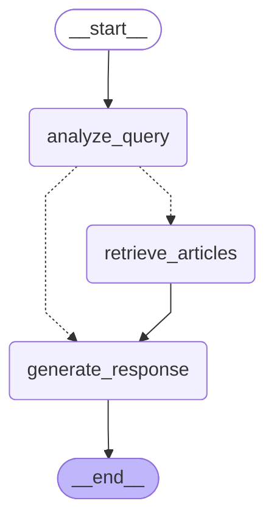

```mermaid
---
config:
  flowchart:
    curve: linear
---
graph TD;
	__start__([<p>__start__</p>]):::first
	analyze_query(analyze_query)
	retrieve_articles(retrieve_articles)
	generate_response(generate_response)
	__end__([<p>__end__</p>]):::last
	__start__ --> analyze_query;
	analyze_query -.-> generate_response;
	analyze_query -.-> retrieve_articles;
	retrieve_articles --> generate_response;
	generate_response --> __end__;
	classDef default fill:#f2f0ff,line-height:1.2
	classDef first fill-opacity:0
	classDef last fill:#bfb6fc

```